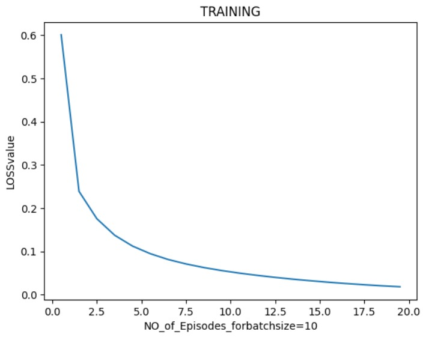
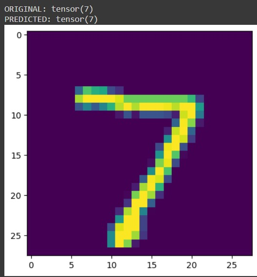

# MNIST Handwritten Digit Recognition with PyTorch

This repository features a handwritten digit recognition model developed with PyTorch, utilizing the MNIST dataset. MNIST is a well-known benchmark in machine learning, comprising 60,000 training images and 10,000 test images of handwritten digits (0-9), each represented as a 28x28 grayscale image.

Key Features:

Data Preprocessing: The dataset undergoes normalization to stabilize and accelerate training. Additionally, data augmentation techniques such as random rotations and shifts are applied to improve model generalization.

Model Architecture: It includes multiple convolutional and pooling layers followed by fully connected layers, specifically designed for digit classification.

Training and Evaluation: The model is trained on the MNIST training data and assessed on the test set. Leveraging PyTorch’s powerful framework, it achieves high accuracy in digit classification.

Results: The model demonstrates strong performance in recognizing handwritten digits with a high degree of precision, making it an excellent foundational project for those interested in deep learning and computer vision.

# RESULTS
The below graph is of loss ( or error) of neural network vs number of episodes 

The below image is an example of digit recognised by neural network

